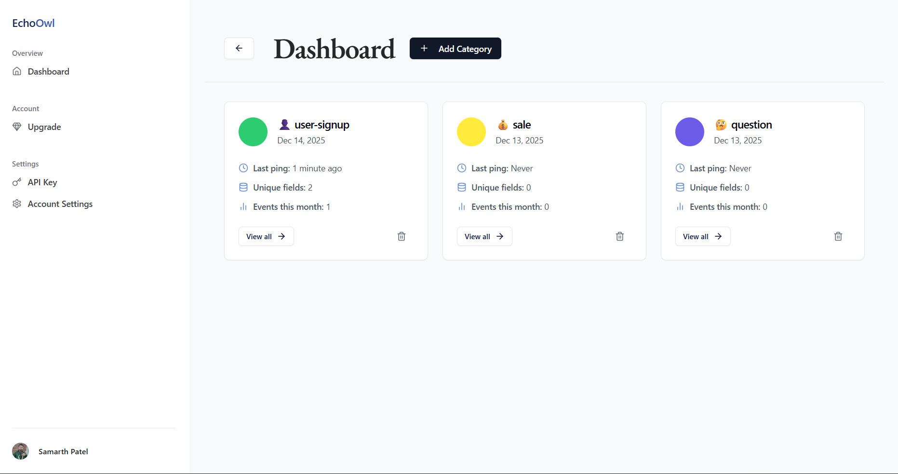
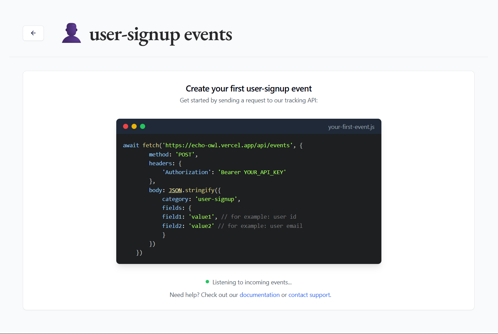
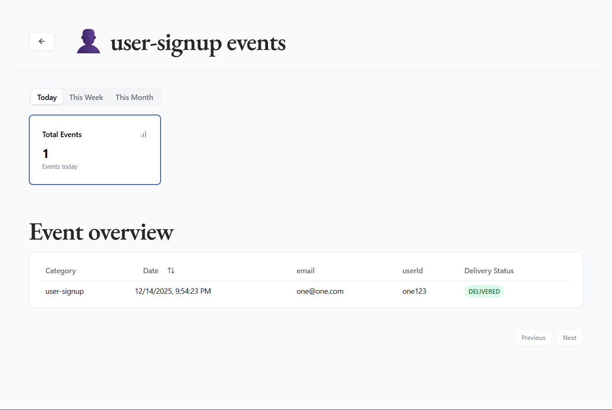
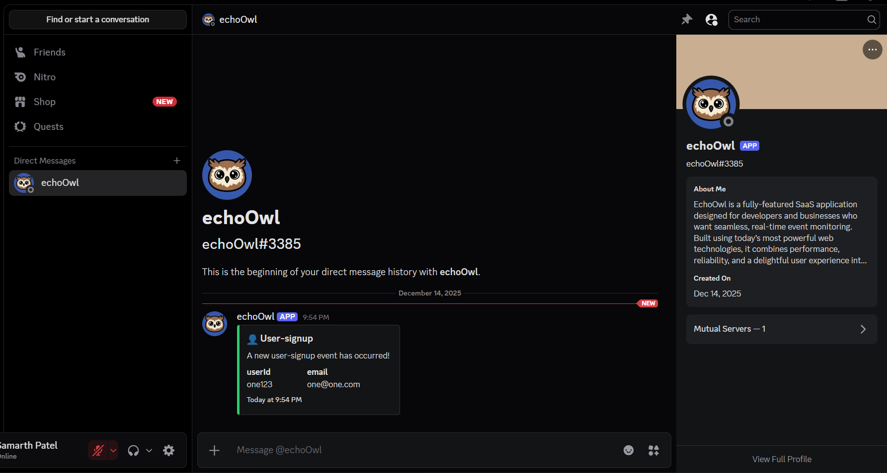
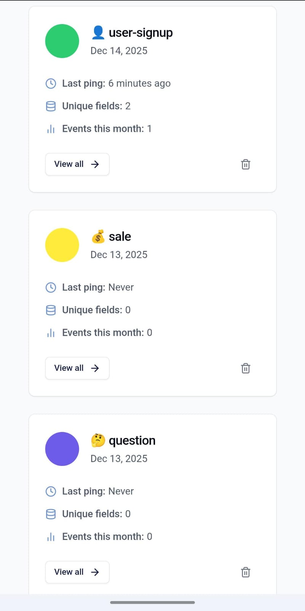
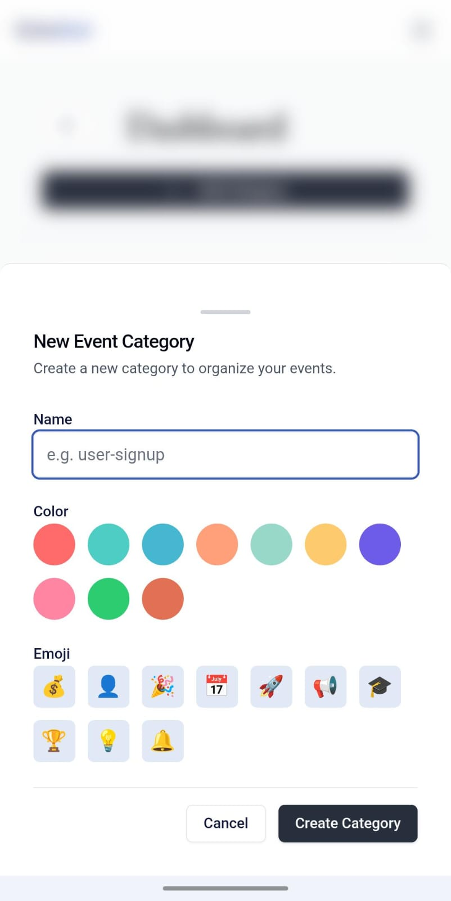
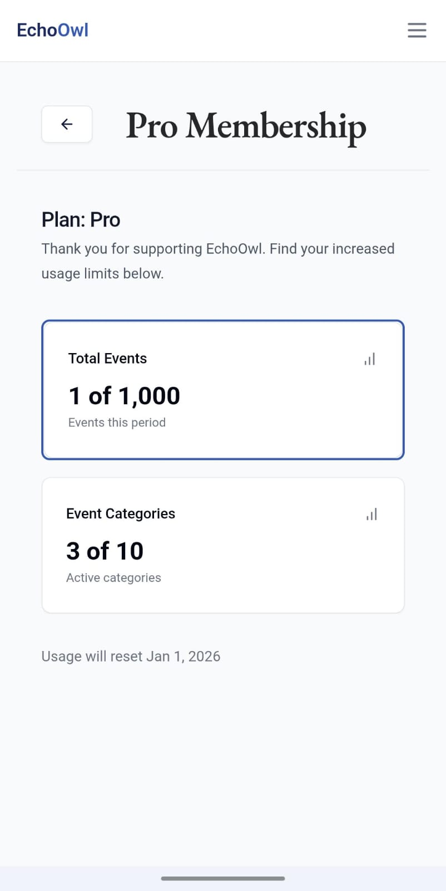

# 🦉 EchoOwl

**EchoOwl** is a production-ready **SaaS event monitoring platform** built with modern **Next.js** and **TypeScript**, designed to deliver real-time alerts via **Discord** with a clean, intuitive dashboard experience.

🌐 **Live Demo:** https://echo-owl.vercel.app/

> A real-world SaaS featuring authentication, subscriptions, Stripe payments, webhooks, and quota-based access control.

---

## 🚀 Features

🛠️ Complete SaaS built with modern Next.js (App Router)  
🎨 Custom artworks generated using Gemini (Nano Banana model)  
✉️ Real-time event notifications via Discord  
🖥️ Clean & intuitive event monitoring dashboard  
💳 Secure payments and subscriptions using Stripe  
🛍️ Users can upgrade to a PRO plan  
🌟 Clean, modern UI built on top of shadcn/ui  
🔑 Authentication and user management via Clerk  
⌨️ 100% written in TypeScript  
🎁 Scalable, production-ready architecture  

---

## 🧠 How It Works

1. Users authenticate securely using Clerk
2. Events are created and categorized from the dashboard
3. EchoOwl monitors events in real time
4. Alerts are delivered instantly via Discord
5. Users can upgrade their account using Stripe
6. Subscription status is kept in sync via Stripe Webhooks

---

## 🧩 Tech Stack

| Category | Technology |
|--------|------------|
| Frontend | Next.js (App Router), React, TypeScript |
| Styling | Tailwind CSS, shadcn/ui |
| State & Data | React Query |
| Backend | Next.js API Routes, Prisma |
| Database | PostgreSQL |
| Authentication | Clerk |
| Payments | Stripe (Checkout & Webhooks) |
| Notifications | Discord REST API |
| Tooling | ESLint, Prettier |
| Deployment | Vercel |

---

## 📸 Screenshots

### Landing Page

### Dashboard

### Event Category (User Signup)

### Event Overview (User Signup)

### Discord Notification

### Mobile Views

  
  
  

---

## 🧑‍💻 Author

**Samarth Patel**  

Full-Stack Software Developer with strong experience building scalable SaaS applications using **React.js, Next.js, Node.js, Express, MongoDB, and AWS**. Proven ability to design secure payment systems, implement real-time and AI-powered features, and deliver production-grade web platforms. Proficient in **CI/CD pipelines, API integrations, and cloud-native deployments**. Active open-source contributor with multiple merged PRs across community projects, driven to ship high-impact solutions in real-world environments.

- 🌐 Portfolio: https://samp231004.github.io/Portfolio/  
- 💼 LinkedIn: https://www.linkedin.com/in/samp2310  
- 💻 GitHub: https://github.com/SamP231004  
- 📧 Email: samp231004@gmail.com  